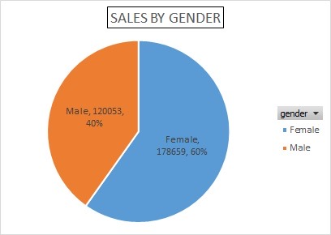
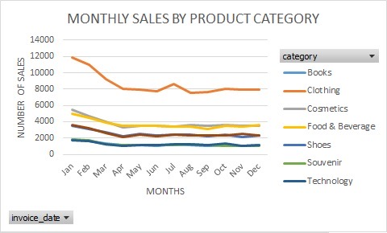
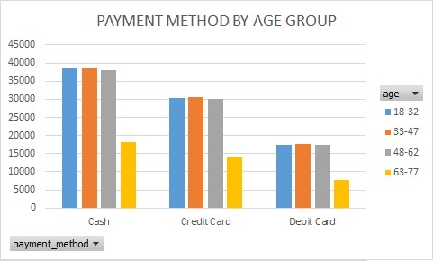

# Ijeoma John | Data Analyst Portfolio

## About Me
Data Analyst with a Google Data Analytics Certificate and hands-on 
experience in Excel, SQL and Tableau. Background in Fashion Design 
and Customer Service with over 3 years of operational experience.
Currently working as a Data Analyst at ICR8tiv Solutions Ltd.

Based in Lisbon, Portugal | Open to remote opportunities globally.

## Skills
- Data Analysis
- Microsoft Excel
- SQL
- Tableau
- Data Cleaning
- Data Visualization
- PivotTable Analysis

## Projects

### Project 1 — Customer Shopping Behaviour Analysis
- Dataset: 99,458 transactions across multiple shopping malls
- Tools: Microsoft Excel, Tableau
- Key Findings:

  - Female customers drive 60% of total purchases
  - Clothing peaks in January and declines after April
  - Cash is the most preferred payment method across all age groups

## Certifications
- Google Data Analytics Certificate
- SQL Server for Data Analysis — Alison
- Diploma in IT Support Help Desk — Alison
- Digital Marketing — Grey Wood Consult

## Contact
- LinkedIn: linkedin.com/in/ijeoma-john-79b937414
